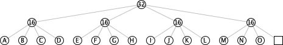

# CSC 101 - Challenge: Quadtree Decoding

For this activity, you need to decode a portion of a quadtree data structure to fill in the pixels of a 32x32 image. Everyone is in charge of a particular 8x8 subportion (`A` ... `P` in the tree above) of the overall image. In some cases, a couple of people are assigned to a particular 8x8 piece - you should each decode the portion and check and consolidate your answer with each other.

Once you have determined what the pixels of your portion of the tree are, you can fill them in [this shared Excel spreadsheet](https://berrycollege2-my.sharepoint.com/:x:/g/personal/nhamid_berry_edu/EbkFvuglNZlDnLH6U1reMOMBB4Xstwxp5oQrmEyNudylYw?e=NSdnA0). As I went over in class, you can copy the entire spreadsheet contents into a *plain text file* with a ".pbm" extension and view the resulting bitmap image. (Use an online converter if your OS doesn't come with an application to view PBM format images.)

## Image portion text codes

You will need to translate the encoded string to a quadtree diagram. And then convert the quadtree into the 8x8 pixel block.

|Part|Encoding|
|-|----------------|
A |	-0-00-00110--0111111-00-01100
B |	--0-001111--0111111-1-11010-11011
C | --1-1101-100010-00-00100--1001000
D | --011-01101-11-11011--0111111
E | --1-10110-11010-00-011100
F | -00-000-0001--0011-101111
G | -1-10-10011-1-1001111
H | --0-0010-010001--01001-111000
I | ---10110-000110-000-0001-1-101111
J | --111-0110-11-10011-1-100101-01-01100
K | -0--100000000
L | -1--1011001-1-10010-1100-11-11001
M | --111-1110-1-10000-1101--1000000--0110110
N | -0--001011-01111-0-0010-01100
O | --011-00101-111-1100--01101-11000
P | 0

## Image portion assignments

|Part|Name|
|-|----------------|
A | 
B | 
C | 
D |    (already done)
E | 
F | 
G |    (already done)
H | 
I | 
J | 
K | 
L | 
M | 
N | 
O | 
P |    (already done)

